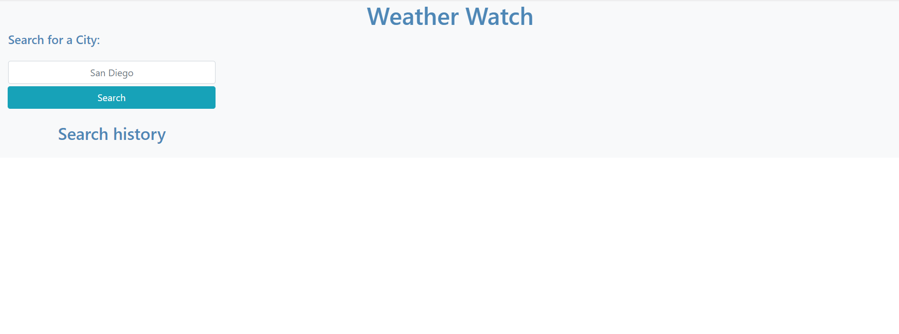
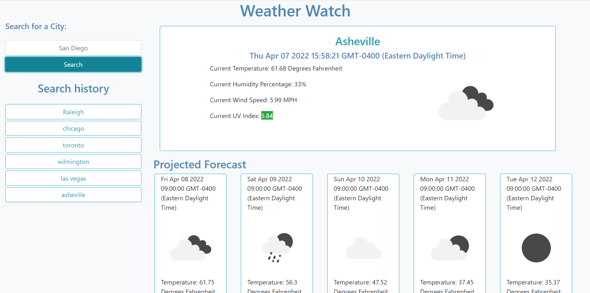

# weather-watch
A weather forecast dashboard

Weather Watch allows the user to search for a city name and view the current weather for that city along with a forecast of the following 5 days. The User's previous searches are saved to a search history section that allows the user to easily return to weather information for previously searched cities.

Weather Watch application is currently available at <https://jasonarritt.github.io/weather-watch/>